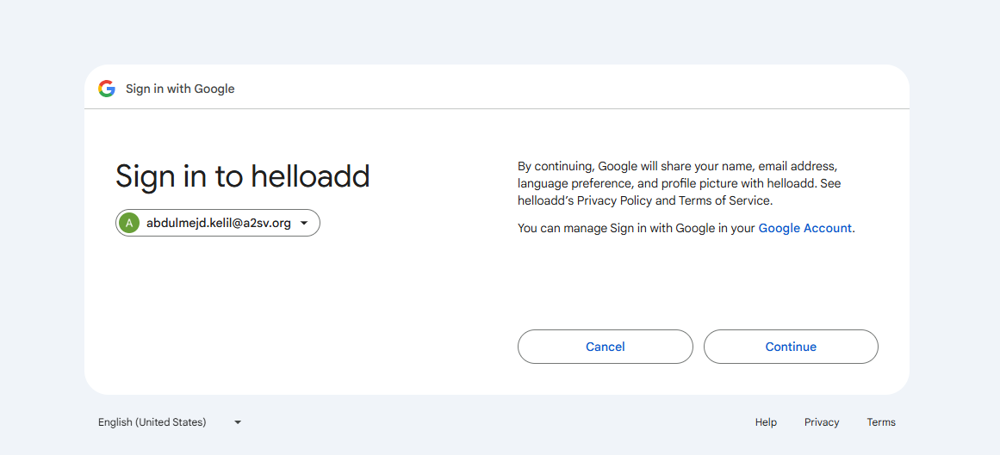
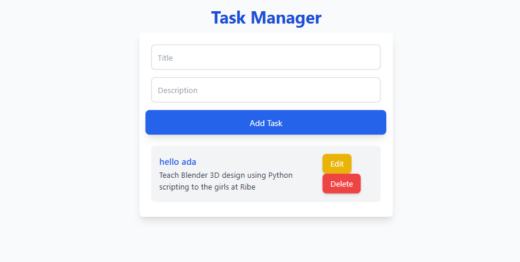

# Task Management Project

## Overview

This project is a task management application built with Next.js, NextAuth, JWT, RTK Query, TypeScript, and Tailwind CSS. It allows users to manage tasks with features for user authentication and CRUD operations. The application uses Prisma and SQLite for database management.

## Features

- User authentication (registration, login, logout)
- Create, view, update, and delete tasks
- Responsive design with Tailwind CSS

## Technologies Used

- **Next.js**: A React framework for server-rendered and statically generated applications.
- **NextAuth**: for authentication and authorization
- **RTK Query**: for effective fetching and api state managment
- **TypeScript**: A superset of JavaScript that adds static types.
- **Tailwind CSS**: A utility-first CSS framework for creating custom designs.
- **Prisma**: An ORM for managing database interactions.
- **SQLite**: A lightweight database used for local development.

## ScreenShots








## Setup

### Prerequisites

- Node.js (>= 18.x)
- npm or Yarn

### Installation

1. Clone the repository:

   ```bash
   git clone https://github.com/yourusername/your-repo-name.git
   cd your-repo-name
   ```

2. Install dependencies:

   ```bash
   npm install
   # or
   yarn install
   ```

3. Set up the database:

   ```bash
   npx prisma migrate dev
   ```

4. Start the development server:

   ```bash
   npm run dev
   # or
   yarn dev
   ```

5. Open `http://localhost:3000` in your browser.

## Configuration

### Environment Variables

Create a `.env` file in the root of the project with the following contents:

```env
DATABASE_URL="file:./dev.db"
NEXTAUTH_SECRET=your-nextauth-secret
NEXTAUTH_URL=http://localhost:3000
GOOGLE_ID=your-google-client-id
GOOGLE_SECRET=your-google-client-secret

```

## Prisma Configuration

The Prisma schema is defined in prisma/schema.prisma. You can customize your database schema here.

## Usage

- Registration: Users can register an account by providing an email and password.
- Login: Users can log in to access their tasks.
- Tasks: Users can create, view, update, and delete tasks.

## Contributing

Feel free to fork this repository and submit pull requests. If you encounter any issues, please open an issue on GitHub.

## License

This project is licensed under the MIT License - see the LICENSE file for details.
